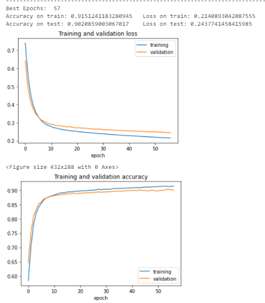

# Real-life-violence-detection

## Data Collection

The data used was data provided by Kaggle. The data is largely divided into Violence and NonViolence for 1000 images each.

[Real Life Violence Situations Data](https://www.kaggle.com/mohamedmustafa/real-life-violence-situations-dataset)

## Model
I have used `InceptionV3` which is a pretrained Imagenet CNN model provided by `Keras`.

Update - `MobileNetV2` is used to with improved accuracy and predictions. This model was created on Kaggle. 

## Output
Output is in the form of a video, which will tell violence/ non-violence on the top left corner.
<!--  -->

https://user-images.githubusercontent.com/56165694/123710016-9eba5f00-d88b-11eb-991b-4e416c96537f.mp4

https://user-images.githubusercontent.com/56165694/123710285-17b9b680-d88c-11eb-9552-d4dfb02605d8.mp4

## Reference
https://www.pyimagesearch.com/2019/07/15/video-classification-with-keras-and-deep-learning/
https://www.pyimagesearch.com/2019/06/03/fine-tuning-with-keras-and-deep-learning/
